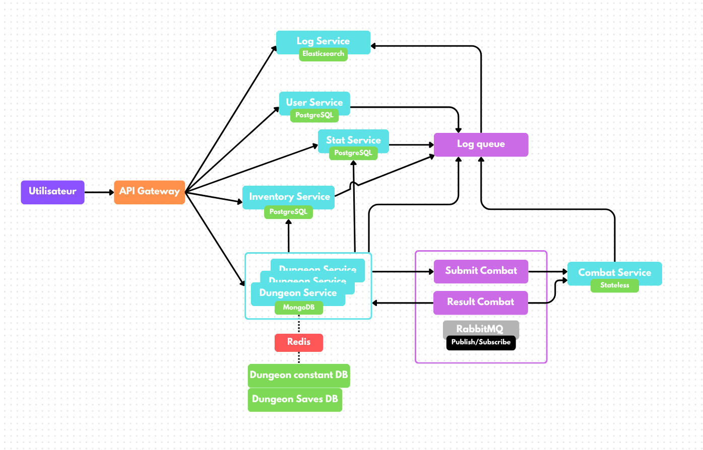

# Erjulrian's world

## Hero's stats
- PV :
- DEF : 
- ATT :
- REGEN :

## Donjon rules
3 floor of 5 rooms. After each rooms you have 2 choices for the next rooms.
There is x different rooms (combat, elite-combat, bonus, debuff, boss).
Dungeon can change your base states during the dungeons and you can find artefact to boost temporally stats.

## Services
- API Gateway				: 3000
- User Service (PostgreSQL)		: 3001
- Hero Service (PostgreSQL)		: 3002
- Inventory Service (PostgreSQL)	: 3003
- Dungeon Service (MongoDB + Redis)	: 3004
- Combat Service (stateless)		: 3005
- Log Service (Elasticsearch)		: 3006

## Data
- SQL models in models/
- Monsters and dungeon runs in JSON models/

## API
- Swagger file: swagger.yaml

## scheme

