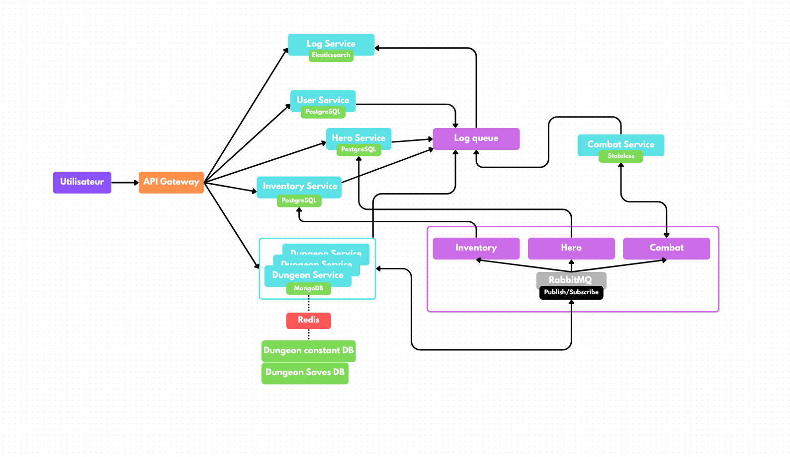
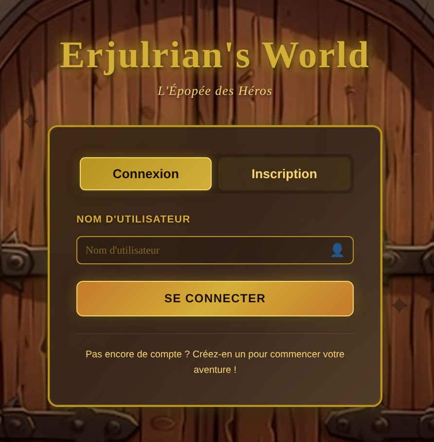
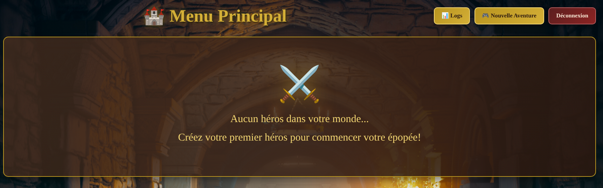
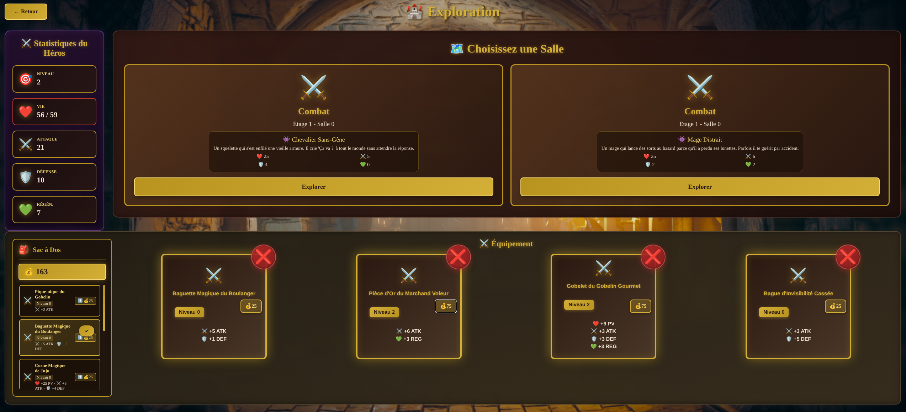
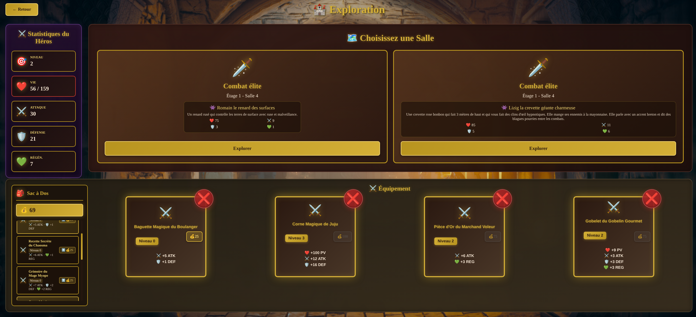
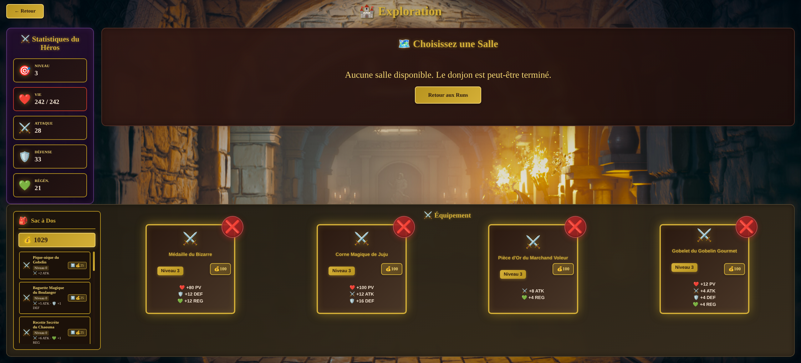

# Erjulrian's world

## Hero's stats
- PV : Number of life points, if you reach 0 you are dead.
- DEF : The higher the defense, the lower the damage you take.
- ATT : The higher the attack, the more damage you deal damage.
- REGEN : The amount of PV you recover each turns.

## Services
- API Gateway				        : 3000
- User Service (PostgreSQL)		    : 3001
- Hero Service (PostgreSQL)		    : 3002
- Inventory Service (PostgreSQL)	: 3003
- Dungeon Service (MongoDB + Redis)	: 3004
- Combat Service (stateless)		: 3005
- Log Service (Elasticsearch)		: 3006

## Data
- SQL models in `models/`
- Json message format in JSON `models/`

## API
- Swagger file: swagger.yaml

## scheme

## Usage

After cloning the repo, go to `services`. Then use `docker compose up -d` to start all containers.
Then just go to [http://localhost:5173/](http://localhost:5173/)

If everything went good you now have access to the login page.

You cant both log in and create a user from here. And you will have access to the main menu then.

From here you can see the logs, create a new game, or log out. After creating your character, you are now in the game.

Now you can see your stats, the equipped artifacts (nothing at the beginning), and the possible two next rooms.
> Note: game is not well balanced and you might be instantly killed by the first opponent.

After a few battles, you have access to loots from previous battles to help you fight stronger opponents.

As you can see monster drop gold and artifacts. You can drag artifacts from you backpack to the empty slots. You can also spend money on artifacts to make them even more powerful.

Also be careful, every 5 rooms a stronger opponent is present. And you have no others choice to fight them.

If you get strong enough to defeat the __secret boss__ you be able to see your run artifacts.

